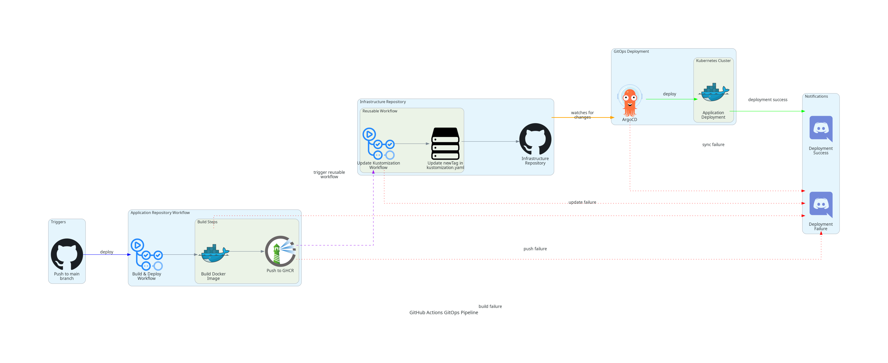

# 🔬 igh9410-infra

All the infrastructure-as-code, configurations, and documentation for my homelab are stored in this repository.
I use my homelab for deploying my side projects and experiment new technologies and Kubernetes cluster.
Additional details can be found on my [blog](https://geonhyukim.com)

## 🏗️ System Architecture & Automation

The cluster is built on virtual machines provisioned by [XCP-ng](https://xcp-ng.org/). After the initial VM setup, I use [Ansible](https://www.ansible.com/) to perform baseline configuration and hardening. The playbooks for this process are located in the `ansible` directory. On top of this foundation, I run [k3s](https://k3s.io/) as my lightweight Kubernetes distribution.

My infrastructure management follows a two-stage approach. Core, foundational components like ArgoCD and Cloudflared are initially provisioned using Terraform (see the `infrastructure/terraform` directory). Once ArgoCD is operational, it takes over the management of all other cluster resources, including applications and services, by following GitOps principles. It continuously synchronizes the cluster state with the configurations defined in this repository.

## ⚙️ Hardware

My homelab runs on a single, powerful machine with the following spec:

- **CPU**: AMD Ryzen 7 8745HS
- **RAM**: 32GB
- **Storage**: 1TB NVMe SSD

This machine runs [XCP-ng](https://xcp-ng.org/) as its bare-metal hypervisor. The Kubernetes cluster itself is composed of five virtual machines:

- **1x Control Plane**
- **4x Worker Nodes**

## 📁 Repository Structure

```
igh9410-infra/
├── apps/                           # Application definitions
│   ├── artskorner-api/
│   │   ├── base/                   # Base Kubernetes manifests
│   │   ├── overlays/prod/
│   │   └── terraform/prod/
│   └── gramnuri-api/
│       ├── base/                   # Base Kubernetes manifests
│       ├── overlays/dev/           # Development-specific patches
│       └── terraform/dev/          # App-specific infrastructure
├── argocd/                         # ArgoCD configuration
│   ├── apps/                       # Application definitions
│   ├── infra-apps/                 # Infrastructure application definitions
│   └── values/                     # Helm values for ArgoCD Applications
├── infrastructure/                 # Kubernetes manifests and Terraform code for infrastructure
│   └── cilium/                     # Cilium stack
│   └── terraform/                  # Main infrastructure code
├── diagram/                        # Architecture diagrams
└── Makefile                        # Automation scripts
```

## Core Components & Applications

### Custom Applications

- **artskorner-api**: API for the Artskorner app.
- **gramnuri-api**: API for the Gramnuri app.

### Core Components

####  [k3s](https://k3s.io/)

Lightweight Kubernetes distribution.

####  [ArgoCD](https://argo-cd.readthedocs.io/)

Declarative, GitOps continuous delivery tool for Kubernetes.

####  [Cilium](https://cilium.io/)

eBPF-based Networking, Observability, Security. Used for CNI, LoadBalancer, and Ingress Controller.

####  [Cloudflared Tunnel](https://www.cloudflare.com/products/tunnel/)

Used for private tunnels to expose public services without a publicly routable IP.

####  [CloudNativePG](https://cloudnative-pg.io/)

Postgres operator for Kubernetes-native environment.

####  [Prometheus](https://prometheus.io/)

Open-source monitoring system with a dimensional data model, flexible query language, efficient time series database and modern alerting approach.

####  [Grafana](https://grafana.com/)

The open observability dashboards.

####  [Loki](https://grafana.com/oss/loki/)

Log aggregation system.

####  [Grafana Alloy](https://grafana.com/oss/alloy/)

Open-source OpenTelemetry collector.

## Networking

In my setup, [Cilium](https://cilium.io/) acts as the CNI, LoadBalancer IPAM, and Ingress controller, streamlining the entire network stack. I chose it over alternatives like Calico for its enterprise-grade features available in the open-source version and rapid adoption in production environments.

For external access, I use [Cloudflared Tunnel](https://www.cloudflare.com/products/tunnel/) to expose services securely without a public IP address.

## Database

For stateful workloads, I use [CloudNativePG](https://cloudnative-pg.io/) to manage PostgreSQL clusters on Kubernetes. It handles the entire lifecycle of a PostgreSQL cluster, from bootstrapping and configuration to high availability and disaster recovery. And I utilize Cloudflare R2 for database backups.

## 🔄 GitOps Workflow

### Application Deployment Flow



1. **Code Changes**: Push application code to respective repositories
2. **Image Build**: GitHub Actions builds and pushes container images
3. **Manifest Update**: Update image tags in Kustomize overlays
4. **ArgoCD Sync**: ArgoCD detects changes and deploys automatically

### Infrastructure Updates

1. **Terraform Changes**: Modify infrastructure code
2. **Plan & Apply**: Review and apply Terraform changes
3. **ArgoCD Config**: Update ArgoCD applications if needed
4. **Verification**: Ensure services are healthy
